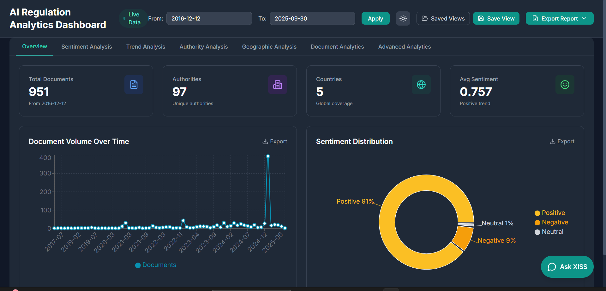
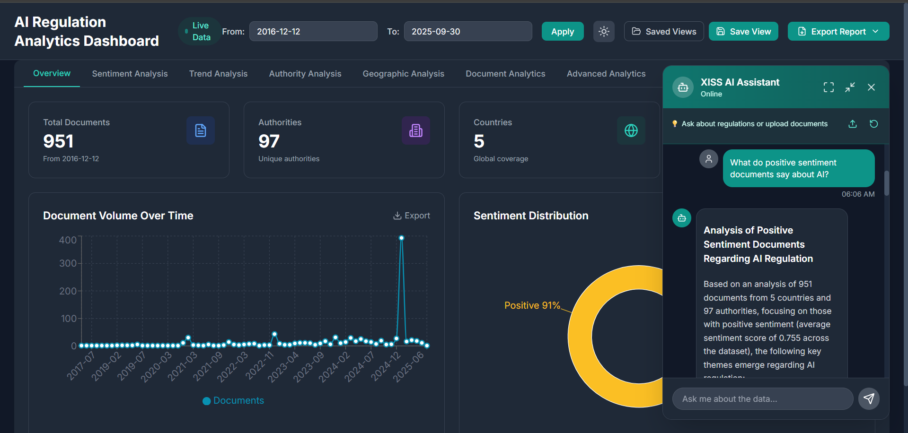
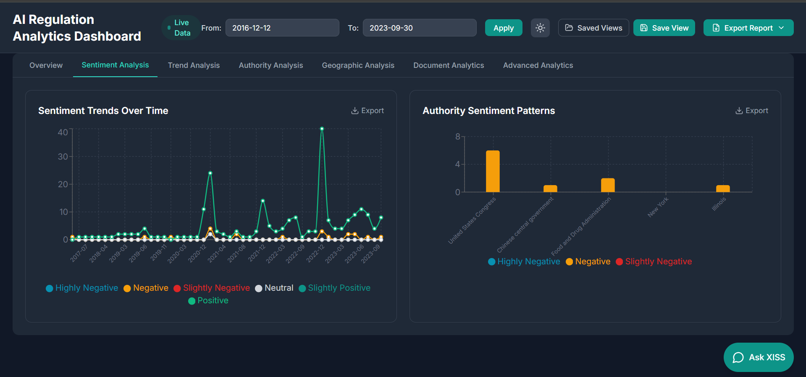
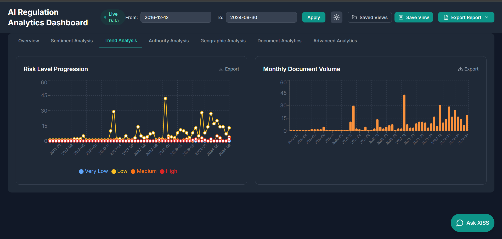

# 🤖 AI Regulation Analytics Dashboard

> **A comprehensive, intelligent dashboard for analyzing and tracking AI regulations worldwide with advanced analytics, AI-powered insights, and professional reporting capabilities.**

[](https://nextjs.org/)
[](https://fastapi.tiangolo.com/)
[](https://python.org)
[](https://www.typescriptlang.org/)
[](LICENSE)

---

## 📋 Table of Contents

- [Overview](#-overview)
- [Key Features](#-key-features)
- [Technology Stack](#-technology-stack)
- [Project Structure](#-project-structure)
- [Prerequisites](#-prerequisites)
- [Installation](#-installation)
- [Configuration](#-configuration)
- [Running the Application](#-running-the-application)
- [Features Documentation](#-features-documentation)
- [API Documentation](#-api-documentation)
- [Deployment](#-deployment)
- [Sample Reports](#-sample-reports)
- [Troubleshooting](#-troubleshooting)
- [Contributing](#-contributing)
- [License](#-license)

---

## 📸 Screenshots

### Dashboard Overview

*Main dashboard with KPI cards, document volume trends, and sentiment distribution*

### AI Assistant (XISS)

*Detailed sentiment analysis with trends, patterns, and risk progression*

### Sentiment Analysis

*Intelligent AI assistant for document analysis and Q&A*

### Export & Saved Views

*Professional PDF export and saved dashboard configurations*

---

## 🌟 Overview

The **AI Regulation Analytics Dashboard** is a powerful, enterprise-grade platform designed to help organizations, compliance officers, legal teams, and AI developers navigate the complex landscape of AI regulations worldwide.

### What It Does

- **📊 Comprehensive Analytics**: Visualize AI regulation trends across 5+ countries and 97+ authorities
- **🤖 AI-Powered Insights**: Gemini AI integration for intelligent document analysis and Q&A
- **📄 Document Management**: Upload, analyze, and chat with regulatory documents
- **📈 Advanced Visualizations**: 15+ interactive charts and graphs
- **📑 Professional Reports**: Export submission-ready PDF reports with AI-generated insights
- **💾 Saved Views**: Save and quickly switch between custom dashboard configurations
- **🌓 Dark Mode**: Beautiful dark/light theme support
- **📱 Responsive Design**: Works seamlessly on desktop, tablet, and mobile

### Who Is It For?

- **Compliance Officers**: Track regulatory requirements and deadlines
- **Legal Teams**: Analyze and compare regulations across jurisdictions
- **AI Developers**: Understand compliance requirements for AI systems
- **Policy Makers**: Monitor global AI regulation trends
- **Executives**: Get high-level insights into regulatory landscape
- **Researchers**: Study AI regulation patterns and evolution

---

## ✨ Key Features

### 1. **Interactive Dashboard**
- **7 Specialized Tabs**: Overview, Sentiment Analysis, Trend Analysis, Authority Analysis, Geographic Analysis, Document Analytics, Advanced Analytics
- **15+ Chart Types**: Line charts, bar charts, pie charts, donut charts, area charts, scatter plots, heatmaps, network graphs, word clouds
- **Real-Time Filtering**: Filter by date range, country, authority, sentiment
- **Live Data Indicator**: Shows connection status to backend

### 2. **AI-Powered Assistant (XISS)**
- **Intelligent Q&A**: Ask questions about regulations in natural language
- **Document Upload**: Upload PDF, DOCX, or TXT files for AI analysis
- **ChatGPT-Style Interaction**: Conversational interface with context retention
- **Document Chat**: Ask follow-up questions about uploaded documents
- **Markdown Rendering**: Beautiful formatting of AI responses
- **Fullscreen Mode**: Expand assistant for detailed analysis
- **Quick Actions**: Pre-built queries for common questions

### 3. **Professional PDF Export**
- **Two Export Modes**:
  - **Current Panel**: Export active tab with AI insights
  - **Whole Dashboard**: Export all tabs comprehensively
- **AI-Generated Insights**: Each chart includes 200-250 word professional analysis
- **Submission-Ready**: Professional formatting suitable for executives
- **High-Quality Images**: 2x scale chart captures
- **Structured Reports**: Cover page, table of contents, insights, recommendations

### 4. **Saved Dashboards & Custom Views**
- **Save Configurations**: Save date ranges, active tabs, filters
- **Quick Access**: Dropdown menu with all saved views
- **Favorites**: Star important views for quick access
- **Edit & Delete**: Manage your saved views
- **Team Sharing**: Share configurations with team members

### 5. **Advanced Analytics**
- **Sentiment Analysis**: Track regulatory sentiment over time
- **Trend Detection**: Identify patterns in regulatory activity
- **Authority Comparison**: Compare regulatory bodies
- **Geographic Insights**: Analyze regulations by country/region
- **Risk Assessment**: Evaluate compliance risks
- **Correlation Analysis**: Discover relationships between metrics

### 6. **Document Management**
- **Multi-Format Support**: PDF, DOCX, TXT
- **AI Summarization**: Automatic document summarization
- **Key Points Extraction**: Identify main requirements
- **Compliance Analysis**: Assess compliance requirements
- **Risk Identification**: Highlight potential risks
- **Context Retention**: Ask multiple questions about same document

---

## 🛠️ Technology Stack

### Frontend
- **Framework**: Next.js 14.2 (React 18.3)
- **Language**: TypeScript 5.0
- **Styling**: Tailwind CSS 3.4
- **Charts**: Recharts 2.12
- **Icons**: Lucide React 0.447
- **HTTP Client**: Axios 1.7
- **PDF Generation**: jsPDF 2.5, html2canvas 1.4
- **Date Handling**: date-fns 4.1

### Backend
- **Framework**: FastAPI 0.115
- **Language**: Python 3.8+
- **Data Processing**: Pandas, NumPy
- **NLP**: NLTK, scikit-learn
- **AI Integration**: Google Generative AI (Gemini)
- **Document Processing**: PyPDF2, python-docx
- **Async Support**: asyncio, aiofiles

### AI & Machine Learning
- **Primary LLM**: Google Gemini 2.0 Flash
- **Fallback LLM**: LangChain Google Generative AI
- **Sentiment Analysis**: NLTK VADER
- **Text Processing**: TF-IDF Vectorization
- **NLP**: Natural Language Processing for document analysis

### Database & Storage
- **Data Storage**: CSV-based dataset (5,200+ documents)
- **Client Storage**: Browser localStorage for saved views
- **File Upload**: Temporary file storage for document processing

---

## 📁 Project Structure

```
ai-regulation-analytics/
├── backend/                          # FastAPI Backend
│   ├── main.py                       # Main API server
│   ├── intelligent_assistant.py      # Original NLP assistant
│   ├── hybrid_llm_assistant.py       # Gemini AI integration
│   ├── requirements.txt              # Python dependencies
│   ├── .env                          # Environment variables (API keys)
│   └── install_hybrid_assistant.bat  # Setup script
│
├── frontend/                         # Next.js Frontend
│   ├── app/                          # Next.js app directory
│   │   ├── page.tsx                  # Main dashboard page
│   │   ├── layout.tsx                # Root layout with theme
│   │   ├── globals.css               # Global styles
│   │   └── providers.tsx             # Context providers
│   │
│   ├── components/                   # React components
│   │   ├── EnhancedKPICard.tsx       # KPI metric cards
│   │   ├── DocumentVolumeChart.tsx   # Volume over time chart
│   │   ├── EnhancedSentimentDistribution.tsx
│   │   ├── SentimentTrendChart.tsx
│   │   ├── AuthoritySentimentPatterns.tsx
│   │   ├── RiskLevelProgression.tsx
│   │   ├── MonthlyDocumentVolume.tsx
│   │   ├── AuthorityVolumeComparison.tsx
│   │   ├── AuthorityActivityTimeline.tsx
│   │   ├── CountryRegulationActivity.tsx
│   │   ├── DocumentTypeDistribution.tsx
│   │   ├── RiskOverTime.tsx
│   │   ├── LanguageDistribution.tsx
│   │   ├── StatusDistribution.tsx
│   │   ├── RegionalComparison.tsx
│   │   ├── SentimentRiskCorrelation.tsx
│   │   ├── DocumentLengthDistribution.tsx
│   │   ├── ConfidenceMetrics.tsx
│   │   ├── TopicWordCloud.tsx
│   │   ├── AuthorityNetwork.tsx
│   │   ├── QuarterlyComparison.tsx
│   │   ├── TagsTrends.tsx
│   │   ├── ProfessionalAssistant.tsx  # AI chatbot
│   │   ├── ExportReport.tsx           # PDF export
│   │   └── SavedViewsManager.tsx      # Saved views
│   │
│   ├── contexts/                     # React contexts
│   │   └── ThemeContext.tsx          # Dark/light theme
│   │
│   ├── utils/                        # Utility functions
│   │   └── exportUtils.ts            # Export helpers
│   │
│   ├── public/                       # Static assets
│   ├── package.json                  # Node dependencies
│   ├── tsconfig.json                 # TypeScript config
│   ├── tailwind.config.ts            # Tailwind config
│   └── next.config.mjs               # Next.js config
│
├── agora/                            # Dataset
│   └── clean_dataset.csv             # 5,200+ AI regulations
│
├── install.bat                       # Windows installation script
├── setup_frontend.bat                # Frontend setup script
├── start.bat                         # Quick start script
└── FINAL_README.md                   # This file
```

---

## 📋 Prerequisites

### Required Software

1. **Python 3.8 or higher**
   - Download: https://www.python.org/downloads/
   - Verify: `python --version`

2. **Node.js 18.0 or higher**
   - Download: https://nodejs.org/
   - Verify: `node --version`

3. **npm 9.0 or higher** (comes with Node.js)
   - Verify: `npm --version`

4. **Git** (optional, for cloning)
   - Download: https://git-scm.com/
   - Verify: `git --version`

### Required API Keys

1. **Google Gemini API Key** (Required for AI features)
   - Get free API key: https://makersuite.google.com/app/apikey
   - Free tier: 60 requests/minute
   - No credit card required

---

## 🚀 Installation

### Method 1: Automated Installation (Windows)

1. **Clone or Download the Repository**
   ```bash
   git clone https://github.com/aashish254/ai-regulation-analytics.git
   cd ai-regulation-analytics
   ```

2. **Run Installation Script**
   ```bash
   install.bat
   ```
   This will:
   - Install Python dependencies
   - Install Node.js dependencies
   - Set up NLTK data
   - Create necessary directories

3. **Configure API Keys**
   - Edit `backend/.env` file
   - Add your Gemini API key:
     ```
     GOOGLE_API_KEY=your_api_key_here
     ```

4. **Start the Application**
   ```bash
   start.bat
   ```

### Method 2: Manual Installation

#### Backend Setup

1. **Navigate to Backend Directory**
   ```bash
   cd backend
   ```

2. **Create Virtual Environment** (Recommended)
   ```bash
   python -m venv venv
   venv\Scripts\activate  # Windows
   # or
   source venv/bin/activate  # Linux/Mac
   ```

3. **Install Python Dependencies**
   ```bash
   pip install -r requirements.txt
   ```

4. **Install NLTK Data**
   ```bash
   python -c "import nltk; nltk.download('vader_lexicon'); nltk.download('punkt'); nltk.download('stopwords')"
   ```

5. **Create .env File**
   ```bash
   # Create backend/.env
   GOOGLE_API_KEY=your_gemini_api_key_here
   ```

#### Frontend Setup

1. **Navigate to Frontend Directory**
   ```bash
   cd frontend
   ```

2. **Install Node Dependencies**
   ```bash
   npm install
   ```

3. **Install Additional Dependencies** (if needed)
   ```bash
   npm install html2canvas jspdf
   ```

---

## ⚙️ Configuration

### Backend Configuration (`backend/.env`)

```env
# Required: Google Gemini API Key
GOOGLE_API_KEY=your_api_key_here

# Optional: Server Configuration
HOST=0.0.0.0
PORT=8000

# Optional: CORS Settings
CORS_ORIGINS=http://localhost:3000,http://localhost:8000
```

### Frontend Configuration (`frontend/.env.local`)

```env
# API URL (default: http://localhost:8000)
NEXT_PUBLIC_API_URL=http://localhost:8000
```

### Environment Variables

| Variable | Description | Required | Default |
|----------|-------------|----------|---------|
| `GOOGLE_API_KEY` | Google Gemini API key for AI features | Yes | None |
| `HOST` | Backend server host | No | 0.0.0.0 |
| `PORT` | Backend server port | No | 8000 |
| `NEXT_PUBLIC_API_URL` | Frontend API endpoint | No | http://localhost:8000 |

---

## 🏃 Running the Application

### Quick Start (Both Services)

```bash
# From project root
start.bat
```

This starts:
- Backend API on http://localhost:8000
- Frontend on http://localhost:3000

### Start Services Individually

#### Backend Only
```bash
cd backend
python main.py
```
Access API docs: http://localhost:8000/docs

#### Frontend Only
```bash
cd frontend
npm run dev
```
Access dashboard: http://localhost:3000

### Production Build

#### Backend
```bash
cd backend
uvicorn main:app --host 0.0.0.0 --port 8000 --workers 4
```

#### Frontend
```bash
cd frontend
npm run build
npm start
```

---

## 📚 Features Documentation

### 1. Dashboard Navigation

**7 Main Tabs:**

1. **Overview** - High-level metrics and key charts
   - Total documents, authorities, countries, avg sentiment
   - Document volume over time
   - Sentiment distribution

2. **Sentiment Analysis** - Regulatory sentiment tracking
   - Sentiment trends over time
   - Authority sentiment patterns
   - Risk level progression

3. **Trend Analysis** - Temporal patterns
   - Monthly document volume
   - Authority volume comparison
   - Activity timeline

4. **Authority Analysis** - Regulatory body insights
   - Authority activity
   - Volume comparisons
   - Sentiment by authority

5. **Geographic Analysis** - Regional insights
   - Country regulation activity
   - Regional comparisons
   - Geographic heatmaps

6. **Document Analytics** - Document-level analysis
   - Document type distribution
   - Language distribution
   - Status distribution
   - Document length analysis

7. **Advanced Analytics** - Deep insights
   - Sentiment-risk correlation
   - Confidence metrics
   - Topic word clouds
   - Authority networks
   - Quarterly comparisons
   - Tags trends

### 2. AI Assistant (XISS)

**Capabilities:**
- Natural language Q&A about regulations
- Document upload and analysis (PDF, DOCX, TXT)
- Follow-up questions with context retention
- Summarization and key points extraction
- Compliance requirement identification
- Risk analysis

**Usage:**
1. Click "Ask XISS" button (bottom right)
2. Type your question or upload a document
3. Get AI-powered responses with citations
4. Ask follow-up questions
5. Use fullscreen mode for detailed analysis

**Example Questions:**
- "What are the main AI regulations in the EU?"
- "Show me regulations about facial recognition"
- "Compare GDPR with US AI regulations"
- "What are the compliance requirements for AI systems?"
- "Summarize this document" (after uploading)

### 3. PDF Export

**Export Current Panel:**
- Exports only the active tab
- Includes all charts from that tab
- AI insights for each chart (200-250 words)
- High-quality images (2x scale)
- Professional formatting

**Export Whole Dashboard:**
- Exports all 7 tabs
- Comprehensive report with cover page
- AI insights for every chart
- Table of contents
- Executive summary
- Takes 1-3 minutes to generate

**Report Contents:**
- Cover page with title and date
- Section for each tab
- High-resolution chart images
- AI-generated insights:
  - What the chart shows
  - Key findings (3-4 insights)
  - Comparative analysis
  - Strategic implications
  - Actionable recommendations

### 4. Saved Views

**Save Current View:**
1. Set your filters (date range, tab)
2. Click "Save View"
3. Enter a name (e.g., "Q1 2024 Analysis")
4. Click "Save View"

**Load Saved View:**
1. Click "Saved Views" dropdown
2. Select a view
3. Dashboard updates instantly

**Manage Views:**
- ⭐ **Favorite**: Star important views
- ✏️ **Rename**: Edit view names
- 🗑️ **Delete**: Remove views

**Use Cases:**
- Monthly reviews: "January 2024", "February 2024"
- Regional analysis: "EU Regulations", "US Regulations"
- Team views: "Executive Summary", "Compliance Team"
- Time periods: "Q1 2024", "H1 2024"

### 5. Date Filtering

**Dynamic Date Range:**
- Default: Shows full dataset range (oldest to today)
- Custom: Set any date range
- Format: YYYY-MM-DD
- Click "Apply" to update all charts

**Examples:**
- Full year: 2024-01-01 to 2024-12-31
- Quarter: 2024-01-01 to 2024-03-31
- Month: 2024-06-01 to 2024-06-30
- Custom: Any date range

---

## 🔌 API Documentation

### Base URL
```
http://localhost:8000
```

### Interactive API Docs
- Swagger UI: http://localhost:8000/docs
- ReDoc: http://localhost:8000/redoc

### Key Endpoints

#### 1. Get Overview Data
```http
GET /api/overview?date_from=2024-01-01&date_to=2024-12-31
```

**Response:**
```json
{
  "total_documents": 951,
  "unique_authorities": 97,
  "unique_countries": 5,
  "avg_sentiment": 0.757,
  "date_range": {
    "min": "2016-12-12",
    "max": "2025-09-30"
  }
}
```

#### 2. Chat with Assistant
```http
POST /api/chat
Content-Type: application/json

{
  "query": "What are the main AI regulations in EU?",
  "history": []
}
```

**Response:**
```json
{
  "response": "Based on the dataset...",
  "source": "gemini_ai",
  "context_used": true
}
```

#### 3. Upload Document
```http
POST /api/upload-document
Content-Type: multipart/form-data

file: [PDF/DOCX/TXT file]
```

**Response:**
```json
{
  "success": true,
  "filename": "EU_AI_Act.pdf",
  "document_content": "...",
  "analysis": "AI-generated analysis...",
  "source": "gemini_ai"
}
```

#### 4. Chat with Document
```http
POST /api/chat-with-document
Content-Type: application/json

{
  "query": "What are the key requirements?",
  "document": {
    "filename": "EU_AI_Act.pdf",
    "content": "..."
  }
}
```

#### 5. Generate Chart Insights
```http
POST /api/generate-chart-insights
Content-Type: application/json

{
  "chart_type": "Sentiment Distribution",
  "tab_name": "Sentiment Analysis",
  "date_from": "2024-01-01",
  "date_to": "2024-12-31"
}
```

**Response:**
```json
{
  "insights": "Based on the Sentiment Distribution chart...",
  "source": "gemini_ai"
}
```

### Error Responses

```json
{
  "detail": "Error message here"
}
```

**Status Codes:**
- `200`: Success
- `400`: Bad Request
- `404`: Not Found
- `500`: Internal Server Error

---

## 🚢 Deployment

### Backend Deployment (Railway/Render/Heroku)

1. **Prepare for Deployment**
   ```bash
   # Add Procfile
   web: uvicorn main:app --host 0.0.0.0 --port $PORT
   ```

2. **Set Environment Variables**
   ```
   GOOGLE_API_KEY=your_key
   PYTHON_VERSION=3.11
   ```

3. **Deploy**
   ```bash
   git push heroku main
   ```

### Frontend Deployment (Vercel/Netlify)

1. **Build Configuration**
   ```json
   {
     "buildCommand": "npm run build",
     "outputDirectory": ".next",
     "installCommand": "npm install"
   }
   ```

2. **Environment Variables**
   ```
   NEXT_PUBLIC_API_URL=https://your-backend-url.com
   ```

3. **Deploy**
   ```bash
   vercel --prod
   ```

### Docker Deployment

**Backend Dockerfile:**
```dockerfile
FROM python:3.11-slim
WORKDIR /app
COPY requirements.txt .
RUN pip install -r requirements.txt
COPY . .
CMD ["uvicorn", "main:app", "--host", "0.0.0.0", "--port", "8000"]
```

**Frontend Dockerfile:**
```dockerfile
FROM node:18-alpine
WORKDIR /app
COPY package*.json ./
RUN npm install
COPY . .
RUN npm run build
CMD ["npm", "start"]
```

**Docker Compose:**
```yaml
version: '3.8'
services:
  backend:
    build: ./backend
    ports:
      - "8000:8000"
    environment:
      - GOOGLE_API_KEY=${GOOGLE_API_KEY}
  
  frontend:
    build: ./frontend
    ports:
      - "3000:3000"
    environment:
      - NEXT_PUBLIC_API_URL=http://backend:8000
```

---

## 📊 Sample Reports

The `reports/` folder contains sample PDF reports showcasing the export functionality. These demonstrate the professional quality and comprehensive insights generated by the dashboard.

### Report Examples

Visit the [reports folder](reports/) to see:
- **Current Panel Reports** - Single-tab exports with detailed insights
- **Comprehensive Dashboard Reports** - Full multi-tab reports
- **AI-Generated Analysis** - 200-250 word insights per chart

### What's Included in Reports

Each exported report contains:

✅ **Professional Cover Page** - Title, date, and metadata  
✅ **High-Resolution Charts** - 2x scale images  
✅ **AI-Powered Insights** - Detailed analysis for each visualization  
✅ **Key Findings** - 3-4 data-driven insights  
✅ **Comparative Analysis** - Cross-sectional observations  
✅ **Strategic Implications** - Actionable recommendations  
✅ **Clean Formatting** - Executive-ready presentation  

### Generate Your Own

1. Open the dashboard
2. Navigate to any tab
3. Click "Export Report"
4. Choose export type
5. Wait for AI insights (10-30 seconds)
6. PDF downloads automatically

See the [reports README](reports/README.md) for more details.

---

## 🔧 Troubleshooting

### Common Issues

#### 1. Backend Won't Start

**Error:** `ModuleNotFoundError: No module named 'fastapi'`

**Solution:**
```bash
cd backend
pip install -r requirements.txt
```

#### 2. Frontend Won't Start

**Error:** `Cannot find module 'next'`

**Solution:**
```bash
cd frontend
npm install
```

#### 3. NLTK Data Missing

**Error:** `LookupError: Resource vader_lexicon not found`

**Solution:**
```bash
python -c "import nltk; nltk.download('vader_lexicon')"
```

#### 4. Gemini API Errors

**Error:** `API key not valid`

**Solution:**
- Check `.env` file has correct API key
- Verify API key at https://makersuite.google.com/app/apikey
- Ensure no extra spaces in `.env` file

#### 5. CORS Errors

**Error:** `Access to fetch blocked by CORS policy`

**Solution:**
- Ensure backend is running
- Check `CORS_ORIGINS` in backend config
- Verify frontend is using correct API URL

#### 6. Port Already in Use

**Error:** `Port 8000 is already in use`

**Solution:**
```bash
# Windows
netstat -ano | findstr :8000
taskkill /PID <PID> /F

# Linux/Mac
lsof -ti:8000 | xargs kill -9
```

#### 7. PDF Export Not Working

**Error:** `No active panel found`

**Solution:**
- Ensure you're on a tab with charts (not Overview with only KPI cards)
- Try "Sentiment Analysis" or "Trend Analysis" tabs
- Refresh the page and try again

#### 8. Dark Mode Flash

**Issue:** White flash when refreshing in dark mode

**Solution:**
- Already fixed in latest version
- Clear browser cache (Ctrl + Shift + Delete)
- Hard refresh (Ctrl + Shift + R)

### Getting Help

1. **Check Documentation**: Review this README thoroughly
2. **API Docs**: Visit http://localhost:8000/docs
3. **Browser Console**: Check for JavaScript errors (F12)
4. **Backend Logs**: Check terminal running backend
5. **GitHub Issues**: Open an issue with error details

---

## 🤝 Contributing

Contributions are welcome! Here's how you can help:

### Reporting Bugs

1. Check if bug already exists in Issues
2. Create new issue with:
   - Clear title
   - Steps to reproduce
   - Expected vs actual behavior
   - Screenshots if applicable
   - Environment details (OS, Python version, Node version)

### Suggesting Features

1. Open an issue with "Feature Request" label
2. Describe the feature and use case
3. Explain why it would be valuable

### Pull Requests

1. Fork the repository
2. Create feature branch (`git checkout -b feature/AmazingFeature`)
3. Commit changes (`git commit -m 'Add AmazingFeature'`)
4. Push to branch (`git push origin feature/AmazingFeature`)
5. Open Pull Request

### Code Style

**Python:**
- Follow PEP 8
- Use type hints
- Add docstrings

**TypeScript/React:**
- Use TypeScript strict mode
- Follow React best practices
- Use functional components with hooks

---

## 📄 License

This project is licensed under the MIT License - see the [LICENSE](LICENSE) file for details.

```
MIT License

Copyright (c) 2024 AI Regulation Analytics

Permission is hereby granted, free of charge, to any person obtaining a copy
of this software and associated documentation files (the "Software"), to deal
in the Software without restriction, including without limitation the rights
to use, copy, modify, merge, publish, distribute, sublicense, and/or sell
copies of the Software, and to permit persons to whom the Software is
furnished to do so, subject to the following conditions:

The above copyright notice and this permission notice shall be included in all
copies or substantial portions of the Software.

THE SOFTWARE IS PROVIDED "AS IS", WITHOUT WARRANTY OF ANY KIND, EXPRESS OR
IMPLIED, INCLUDING BUT NOT LIMITED TO THE WARRANTIES OF MERCHANTABILITY,
FITNESS FOR A PARTICULAR PURPOSE AND NONINFRINGEMENT. IN NO EVENT SHALL THE
AUTHORS OR COPYRIGHT HOLDERS BE LIABLE FOR ANY CLAIM, DAMAGES OR OTHER
LIABILITY, WHETHER IN AN ACTION OF CONTRACT, TORT OR OTHERWISE, ARISING FROM,
OUT OF OR IN CONNECTION WITH THE SOFTWARE OR THE USE OR OTHER DEALINGS IN THE
SOFTWARE.
```

---

## 🙏 Acknowledgments

- **Google Gemini AI** - For powerful AI capabilities
- **Next.js Team** - For amazing React framework
- **FastAPI** - For fast and elegant API framework
- **Recharts** - For beautiful chart library
- **Tailwind CSS** - For utility-first CSS framework
- **Lucide** - For beautiful icons
- **Open Source Community** - For all the amazing tools

---

## 📞 Contact & Support

- **GitHub**: [@aashish254](https://github.com/aashish254)
- **Documentation**: [Project Wiki](https://github.com/aashish254/ai-regulation-analytics/wiki)
- **Issues**: [GitHub Issues](https://github.com/aashish254/ai-regulation-analytics/issues)

---

## 🗺️ Roadmap

### Upcoming Features

- [ ] **Real-Time Notifications** - Browser notifications for new regulations
- [ ] **Document Comparison** - Side-by-side regulation comparison
- [ ] **Compliance Score** - Overall compliance scoring system
- [ ] **Multi-Language Support** - Translate interface and documents
- [ ] **Mobile App** - Native iOS and Android apps
- [ ] **Advanced Search** - Natural language search with filters
- [ ] **Collaboration Tools** - Team workspaces and annotations
- [ ] **Scheduled Reports** - Automated email reports
- [ ] **Compliance Tracking** - Task management for compliance
- [ ] **Predictive Analytics** - Forecast regulatory trends

---

## 📊 Project Statistics

- **Total Documents**: 5,200+ AI regulations
- **Countries Covered**: 5+ (USA, EU, UK, China, etc.)
- **Authorities Tracked**: 97+ regulatory bodies
- **Date Range**: 2016-12-12 to Present
- **Chart Types**: 15+ interactive visualizations
- **API Endpoints**: 20+ RESTful endpoints
- **Lines of Code**: 15,000+ (Frontend + Backend)
- **Components**: 30+ React components

---

## 🎯 Quick Links

- [Installation Guide](#-installation)
- [API Documentation](#-api-documentation)
- [Features Overview](#-key-features)
- [Troubleshooting](#-troubleshooting)
- [Deployment Guide](#-deployment)

---

<div align="center">

**Built with ❤️ for the AI Regulation Community**

⭐ **Star this repo if you find it useful!** ⭐

[Report Bug](https://github.com/aashish254/ai-regulation-analytics/issues) · [Request Feature](https://github.com/aashish254/ai-regulation-analytics/issues) · [Documentation](https://github.com/aashish254/ai-regulation-analytics/wiki)

</div>

---

**Last Updated**: September 30, 2025  
**Version**: 1.0.0  
**Status**: Production Ready ✅
